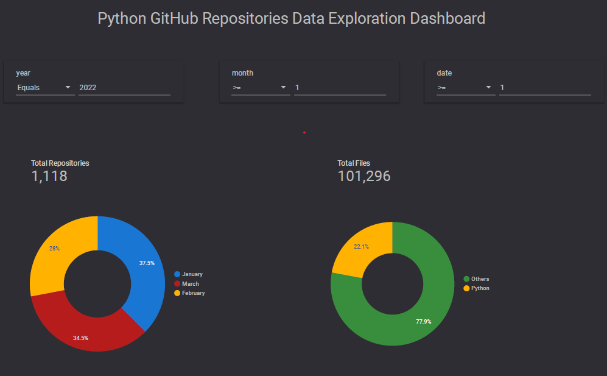
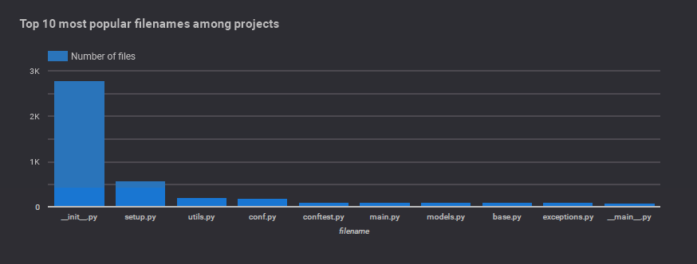
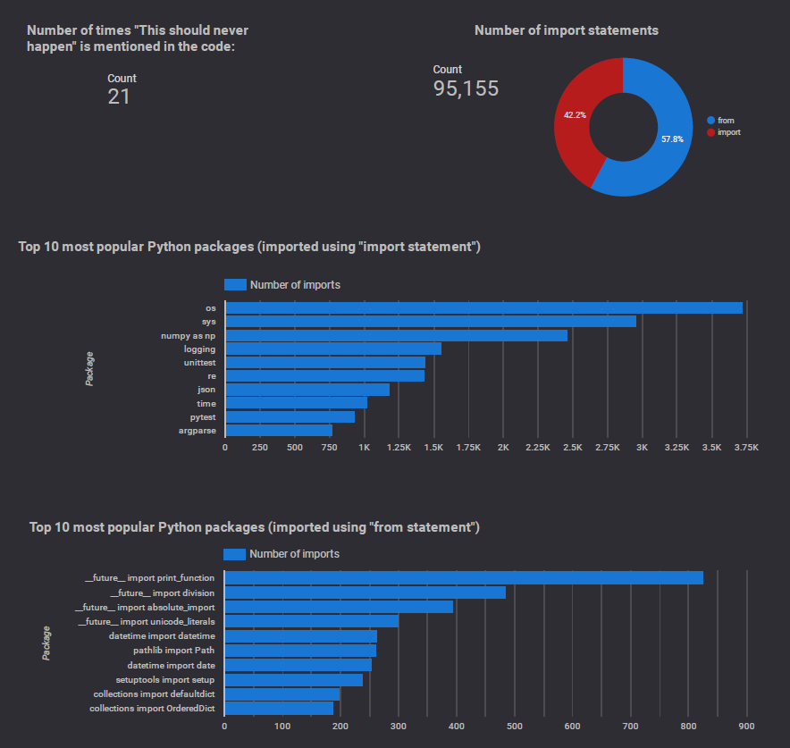

# Github Repos Data Exploration

Analysing the Open Source GitHub repositories using Data Engineering Tools.

## Problem Description

The aim of this project is to build an end-to-end data pipeline showcasing some of the 
Data Engineering best practices. I will be using the public 
[GitHub respositories data](https://console.cloud.google.com/marketplace/details/github/github-repos?filter=solution-type:dataset&project=github-repos-data-exploration)
to analyse Python repositories out of the 2.8 million open source projects.

The data pipeline will perform ELT operations on the raw dataset available on BigQuery
to answer questions such as- `What are the top 10 Python packages?` or 
`What are the top 10 most popular Python filenames?`

## Technologies Used

- `Terraform` for Infrastructure as Code (IaC)
- `dbt` for data transformation
- `GCP` as a cloud platform
- `BigQuery` as a data warehouse
- `Google Cloud Storage (GCS)` as data lake
- `Looker Studio` for creating dashboard and reports
- `PySpark` for distributed processing
- `Poetry` for managing Python Dependencies
- `Prefect` as a workflow orchestration tool

## Key Findings

In my analysis I have filtered on the projects that were updated between start of January 2022 
and end of March 2022.

The dashboard looks like the following:



- As indicated above a total of `1,118` Python repositories containing a total of `22,356` Python
files were considered for this analysis.



- The `10 most popular filenames` seem a bit intuitive. It is interesting to see `models.py` as
one of the entries.



- There are a total of `95,155` import statements present in the Python files. With `57.8%` of those
imported using the `from` syntax and the rest using direct `import`.
- `numpy` and `pytest` are the two most popular third party packages.
- As a fun fact there are about `21` instances of `This should never happen` in the contents of the Python files.

For more information on the queries that were run to get these figures please refer to the [Dashboard Queries](#dashboard-queries) section.

## Steps to Reproduce

I am using a makefile to orchestrate the infrastructure and the processing steps. I am running this on
my WSL Ubuntu installation.

0. Clone this repository to your local workspace.

1. Create a project on GCP. I have set my project name as `Github Repos Data Exploration` 
(project-id: `github-repos-data-exploration`)

2. Install all the required tools such as `terraform`, `gcloud`, `poetry` and 
Python modules (`dbt`, `prefect`). You might be prompted to authenticate with your GCP account.

```
make setup
```

3. (Optional) If not prompted to authenticate in step 2, simply run the following command which will open up 
a page in your web browser and prompt you to verify access.

```
gcloud auth login
```

4. Run terraform to create the infrastructure on the cloud. Before running this make sure to  set 
your variables under [terraform/variables.tf](./terraform/variables.tf).

```
make create-infra
```

5. Create Prefect blocks to store the cloud credentials.

```
make create-prefect-blocks
```

6. Run the Prefect flow that would run the ELT tasks sequentially.

```
make run-elt-flow
```

7. Create dashboard using Looker studio.

8. Finally, cleanup the resources.

```
make cleanup
```

## Further Improvements

- Adding stream processing for the new incoming data.
- CI/CD for setting up the infrastracture and running the data pipeline on schedule.
- Unit and integration testing.

> **_Note_**: I do understand that this data pipeline is far from perfect. Any kind of 
feedback would be appreciated. Alternatively, feel free to reach out if you
are looking to get started with any of the technologies used. I would be happy to help.

## Dashboard Queries

A total of three data sources were added to the dashboard:

1. `Base` table, the resulting `hive_partitioned_table` stored on BigQuery.
2. `Filenames` table, to extract the Python file names. Built on top of the `hive_partitioned_table`.

```
select array_reverse(SPLIT(path, "/"))[OFFSET(0)] as filename, date, month, year 
from `github-repos-data-exploration.github_repos_data_exploration_dataset.hive_partitioned_table` 
where RIGHT(path, 3)=".py"
```

3. `Package Imports` table, built on top of the `hive_partitioned_table` to extract the import
statements from the contents

```
select line, date, month, year 
from (
  select SPLIT(content, "\n") as lines, date, month, year 
  from `github-repos-data-exploration.github_repos_data_exploration_dataset.hive_partitioned_table`
  where RIGHT(path, 3)=".py"
),
UNNEST(lines) as line
where LEFT(line, 7) = "import " or LEFT(line, 5) = "from "
```

Finally, for the charts, I added a few extra fields and filters:

1. For `Total number of Python files`: Added a new field `file_type` to the `Base` table.

```
CASE 
	WHEN ENDS_WITH(path, ".py") THEN "Python"
ELSE "Others"
ENDCASE 
	WHEN ENDS_WITH(path, ".py") THEN "Python"
ELSE "Others"
END
```

2. For `Import statements`: added a new field `import_type` to indicate whether a `from` or `import`
syntax, and `package_name` field to extract the package name.

```
# import_type
CASE
	WHEN STARTS_WITH(line, "import ") THEN "import"
ELSE "from"
END

# package_name
CASE
  WHEN import_type = "import" THEN RIGHT_TEXT(line, LENGTH(line)-7)
  ELSE RIGHT_TEXT(line, LENGTH(line)-5)
END
```

Link to the dashboard - https://lookerstudio.google.com/s/lMK5qfvxIsE
